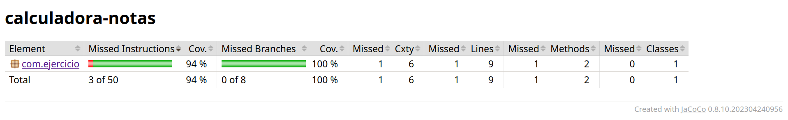

# UT6-A3 Cobertura de código en Java

### Objetivo de la práctica

El objetivo de esta práctica es comprender el concepto de **cobertura de código** y analizar qué partes de un programa están siendo ejecutadas durante las pruebas.

Mediante esta práctica aprenderás a:

- ejecutar tests automatizados  
- medir la cobertura de código  
- identificar partes del programa que no están siendo probadas  
- mejorar los tests para aumentar la cobertura

### Creación del proyecto Maven

Antes de comenzar debes tener instalado:

+ Java (OpenJDK 17 o superior)
+ Maven
+ Visual Studio Code
+ Extensión "Extension Pack for Java"

Para comprobarlo ejecutamos los comandos:

```bash
java -version
````

Si no lo tenemos instalado ejecutamos:

```bash
sudo apt update
sudo apt install openjdk-17-jdk
````


```bash
mvn -version
````

Si no lo tenemos instalado ejecutamos:

```bash
sudo apt install maven
````

Seguiremos los siguientes pasos:

+ Abre VS Code
+ Pulsa ``Ctrl + Shift + P``
+ Escribe ``Java:Create Java Project``
+ Selecciona ``Maven``
+ Selecciona ``maven-archetype-quickstart``
+ Introduce:

````
groupId: com.ejemplo
artifactId: calculadora-notas
````
La estructura del proyecto debe quedar de la forma siguiente:
````
calculadora-notas/
├── pom.xml
└── src/
├── main/java/com/ejemplo/App.java
└── test/java/com/ejemplo/AppTest.java
````

Para crear la clase principal en la ruta ``src/main/java/com/ejemplo/`` creamos el archivo ``CalculadoraNotas.java``, cuyo contenido es:

```java
public class CalculadoraNotas {

    public static double calcularMedia(int[] notas) {

        if(notas.length == 0){
            throw new IllegalArgumentException("Lista vacía");
        }

        int suma = 0;

        for(int nota : notas){

            if(nota < 0 || nota > 10){
                throw new IllegalArgumentException("Nota fuera de rango");
            }

            suma += nota;
        }

        return (double) suma / notas.length;
    }
}
```

### Test iniciales

En la ruta  ``src/test/java/com/ejemplo/`` crea el archivo ``CalculadoraNotasTest.java`` con los siguientes tests:

```java
import static org.junit.jupiter.api.Assertions.*;
import org.junit.jupiter.api.Test;

public class CalculadoraNotasTest {

    @Test
    void testMediaSimple(){
        assertEquals(7, CalculadoraNotas.calcularMedia(new int[]{6,7,8}));
    }

    @Test
    void testMediaDecimal(){
        assertEquals(8.5, CalculadoraNotas.calcularMedia(new int[]{10,9,8,7}));
    }
}
````

### Cobertura de código

La cobertura de código indica qué porcentaje del programa es ejecutado durante la ejecución de los tests. Por ejemplo: si un programa tiene 10 líneas y los tests ejecutan 7 → cobertura del 70%

Para medir la cobertura utilizaremos JUnit y JaCoCo. Vamos a configurarlos:

+ Sustituye el contenido de a <dependencies> por:

```xml
<dependencies>
    <dependency>
        <groupId>org.junit.jupiter</groupId>
        <artifactId>junit-jupiter</artifactId>
        <version>5.10.0</version>
        <scope>test</scope>
    </dependency>
</dependencies>
````

+ Para usar los plugins que necesitamos dentro de <build> añadimos lo siguiente:

```xml
<build>
    <plugins>

        <!-- Plugin para ejecutar tests -->
        <plugin>
            <groupId>org.apache.maven.plugins</groupId>
            <artifactId>maven-surefire-plugin</artifactId>
            <version>3.1.2</version>
        </plugin>

        <!-- Plugin de cobertura JaCoCo -->
        <plugin>
            <groupId>org.jacoco</groupId>
            <artifactId>jacoco-maven-plugin</artifactId>
            <version>0.8.10</version>

            <executions>
                <execution>
                    <goals>
                        <goal>prepare-agent</goal>
                    </goals>
                </execution>

                <execution>
                    <id>report</id>
                    <phase>test</phase>
                    <goals>
                        <goal>report</goal>
                    </goals>
                </execution>
            </executions>

        </plugin>

    </plugins>
</build>
````
+ Para ejecutar los tests y comprobar la cobertura abrimos una terminal y ejecutamos el comando ``mvn clean test``
+ El informe de cobertura se genera automáticamente en la ruta  ``target/site/jacoco/index.html``, al abrir este archivo deberíamos ver algo del tipo:

````
Coverage: 60%
````

### Actividad


Debes analizar qué partes del código no están siendo ejecutadas por los tests actuales.

Posteriormente debes crear nuevos tests para comprobar también los siguientes casos:

- lista vacía

```java


````


- nota fuera de rango

```java


````


Tras añadir los nuevos tests debes volver a ejecutar los tests e intentar conseguir una cobertura mínima del 90%. A continuación inserta una captura de pantalla con el resultado de la cobertura de los test:



### Reflexión final

+ ¿Qué partes del código no estaban cubiertas? 

No se ejecutaban todas las partes del método ```calcularMedia```. Aunque las condiciones principales estaban probadas, faltaban algunos casos dentro del cálculo del bucle, por lo que no todo el código se estaba ejecutando.

+ ¿Qué tests has añadido?

He añadido tests para cubrir los casos que faltaban:

1. Un test con una sola nota para comprobar el funcionamiento básico del cálculo.
2. Un test con valores extremos dentro del rango válido (0 y 10).
3. Tests para asegurar la ejecución completa de todas las partes del método.

+ ¿Qué cobertura final has obtenido?

Tras añadir estos tests, la cobertura final ha aumentado hasta aproximadamente el 100% en branches y una cobertura muy alta en instrucciones, alcanzando prácticamente una cobertura total del código.

Debes subir a tu repositorio de GitHub:

- El archivo ``CalculadoraNotas.java``

- El archivo ``CalculadoraNotasTest.java`` con los nuevos tests añadidos

- Este archivo ``README.md`` con las evidencias solicitadas

Incluyendo:

+ captura del informe de JaCoCo
+ porcentaje final de cobertura

